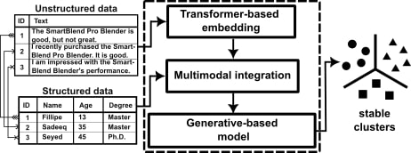

#  SIRIEMA: A Framework to Enhance Clustering Stability by Fusing Multimodal Data

In this project, we introduce SIRIEMA, a novel multimodal framework that seamlessly integrates categorical, numerical, and text data to bolster clustering robustness.
It represents a novel approach to customer segmentation and paves the way for future exploration of data fusion techniques in the context of marketing and other applications.

## SIRIEMA
It has three key components:  a transformer-based model, a data fusion component, and a generative-based model. 

<p align="center">

</p>

- **Transformer-based Model Component:** This component employs a pre-trained transformer-based model, including, but not limited to, BERT, GPT-3.5, Llama, and others.  Without specialized heads, these models are exclusively for embedding purposes, leveraging their extensive pre-existing knowledge. We denote the output of this process as **x**, which provides our framework with robust encoding capabilities for textual information, thereby delivering significant advantages.

- **Data Fusion Component:** This component receives the transformer-based model component's output (**x**), along with categorical (**c**) and numerical (**n**) features as input, and produces an output denoted by **m**, which any generative-based model then receives. Table below presents all those methods.

<p align="center">

</p>

> |**Note**: Uppercase bold letters represent 2D matrices, and lowercase bold letters represent 1D vectors. **b** is a scalar bias, **W** represents a weight matrix.|

- **Generative-based Model Component:** This component processes the output **m** from the  data fusion component. It employs well-established generative models, such as Variational Autoencoders (VAEs) and Generative Adversarial Networks (GANs), to foster more cohesive and stable clustering solutions by deeply understanding the underlying data distributions. 
With this approach, we aim to establish robust clusters that capture subtle patterns and relationships within the data, ensuring consistent and reproducible outcomes across various data scenarios.


## Reproducibility

### Installing R and Python

#### R
- R (v.4.2.2) https://cran.r-project.org/bin/windows/base/old/4.2.2/
- Rtools: https://cran.r-project.org/bin/windows/Rtools/rtools42/rtools.html

#### R packages
 These package are necessary for computing clustering stability.

```bash
$ install.packages("tsne")
$ install.packages("devtools")
$ install.packages("dplyr")
$ install.packages("clue")
$ install.packages("devtools")
$ library(devtools)
$ install_github("cran/OTclust")  
```

#### Python

```bash
$ pyenv local 3.10.0
$ python -m venv . (inside SIRIEMA folder)
$ /Script/activate
$ python -m pip install -r requirements.txt
```

#### Methodology
We present a methodology to evaluate whether the proposed approach improves clustering stability in multimodal data environments.
Figure below  presents the methodology's workflow.
<p align="center">

</p>

- **(1) Structured and Textual data collection:** In this phase, two distinct data types are gathered: structured data, which includes measurable attributes like age, income, and status, and textual data, encompassing non-numeric information such as customer feedback from social media. 

- **(2) Data Preprocessing:** Structured and textual data are preprocessed using several strategies: data attributes are normalized, the scales of variables are aligned, outliers are removed, noise is mitigated, and categorical features are one-hot encoded. The text data is also cleaned by stripping HTML tags, purging non-alphanumeric characters, eliminating stop words, and lemmatizing words. Depending on the chosen transformer-based model, the data is also tokenized, missing values are addressed, typos are corrected, unnecessary whitespace is trimmed, and techniques like stemming or additional lemmatization are applied to return words to their root forms. This thorough preprocessing ensures that the text data is in an optimal format and condition for the transformer model, enhancing the accuracy of results and predictions.

- **(3) Feature Engineering:** In this phase, structured and textual data are integrated into a unified dataset, ensuring seamless integration for further analysis. It is important to note that individual users often provide multiple types of text entries, including feedback, comments, and reviews. To efficiently integrate these entries into the database, a method has been adopted in which each text entry is systematically paired with its corresponding structured data, ensuring each pair occupies a distinct sample. This approach ensures that every text entry maintains a clear association with its pertinent user attributes. Adopting this proactive data representation strategy not only enhances the comprehensiveness and accuracy of our results but also provides deeper insights into the findings.

- **(4) Clustering Analysis:**
In this phase, clustering algorithms, known for their instability in specific scenarios, are employed. The challenges they present are explored to enhance their stability in the context of multimodal data. Algorithms such as K-means, which can be affected by initialization, and advanced algorithms like Agglomerative Hierarchical Clustering (AHC) and Density Based Spatial Clustering of Application with Noise (DBSCAN), known for their susceptibilities leading to variability in clustering results, are considered. For diverse insights into clustering stability, several metrics are incorporated:
- **(4.1)** Adjusted Rand Index (ARI) measures the similarity between two data clusterings, accounting for chance. It scores from -1 (entirely disjoint) to 1 (identical clusterings).
- **(4.2)** Adjusted Mutual Information Score (AMIS), derived from mutual information, adjusts for chance.
- **(4.3)** BagClust (BG) uses resampling techniques to gauge clustering stability and a bootstrapped aggregation process to evaluate clustering robustness.
- **(4.4)** Hierarchical Agglomerative Nesting (HAN) provides a stability index for each data point in the cluster analysis.
- **(4.5)** Optimal Transport Alignment (OTA) conducts a detailed stability analysis with Optimal Transport (OT) distance, considering both cluster proximity and point dispersion within clusters.
Metrics **4.2** through **4.5** rates from 0 (poor stability) to 1 (optimal stability).

In order to conduct a more comprehensive analysis of the clustering outcomes, supplementary metrics, including the silhouette score, Calinski-Harabasz Score, and Davies–Bouldin Score are employed. 

- **(5) Multimodal Framework:** In this phase, a range of transformer-based and generative models is actively refined and experimented with to enhance clustering stability. To achieve this, various transformer architectures are first explored, with factors such as model size, layer count, and the intricacies of their self-attention mechanisms being considered. A range of generative models is also assessed, including VAEs and GANs. Each model combination is subsequently tested and benchmarked to evaluate its performance, scalability, and ability to handle the challenges posed by the multimodal nature of the dataset. By mapping and understanding the intricate data distributions within the multimodal dataset, the clustering algorithms are guided by these models, creating intrinsically stable and cohesive clusters.

- **(6) Interpretation and evaluation:**
In this stage, the stability and consistency of clusters derived from the multimodal framework are assessed. These results are compared with those from the Clustering Analysis conducted in step 3. The same stability metrics are employed to investigate the clustering stability, ensuring a consistent evaluation. The evaluation encompasses an assessment of the silhouette score, CHS, and the application of the DBS. The objective is to confirm that clusters formed by the Multimodal Framework are maintained as stable and robust across multiple runs or data subsets, emphasizing the formation of well-defined groups that retain their integrity in varied scenarios.

- **(7) Data visualization and analysis:** In this step, outputs from the multimodal framework are explored and visualized to understand the segments better and identify stable clusters critical for the subsequent clustering stability analysis. During the Data Visualization and Analysis phase, scatter plots, heatmaps, and histograms are employed to examine the data, highlighting emerging patterns that inform cluster stability analysis. Through these visual aids, a deeper comprehension of the data is achieved, and further steps in the clustering stability analysis are guided by illustrating the dataset's intricate dynamics. Additionally, outliers and anomalies are identified in this phase. Data points that differ significantly from the rest are distinguished using clustering and principal component analysis methods.
By recognizing and studying these unique elements, a deeper insight into the diverse groupings within the customer base is provided to businesses. This insight reveals potential opportunities for enhancing product or service quality and ensuring a robust clustering solution.

#### Train
To train the model in a simple and direct manner, use the following command:

```bash
$ cd SIRIEMA/src/model
$ python main.py ../../datasets/processed/yelp/train_config.json
```
Or by utilizing the Jupyter Notebook: [**src/model/notebook/SIRIEMA.ipynb**](https://github.com/fsant0s/SIRIEMA/blob/main/src/model/notebook/SIRIEMA.ipynb)

#### Inference

There are two distinct approaches for performing inference:

- **1**: In the file train_config.json, configure do_eval as True to activate prediction capabilities on the validation dataset. Additionally, set do_predict to True if you wish to enable predictions on the test dataset.

- **2**: Using predict.py file
```bash
$ cd SIRIEMA/src/model
$ python predict.py
```

#### Compute clustering stability
```bash
$ cd /src/stability_algorithms
$ python .\main.py melbourne_airbnb_open_data/stab_config/test/stab_config-model-100.json
```

Or by utilizing the Jupyter Notebook: [**src/model/notebook/computing_stability.ipynb**](https://github.com/fsant0s/SIRIEMA/blob/main/src/model/notebook/computing_stability.ipynb)

## Results

> 
> 
> 
> 
> 
Comparing stability metrics of all strategies across different sample sizes in the Yelp on the test dataset.
Underlined scores are the best in each row, while bold ones highlight the results of our proposed framework. 
The strategies are as follows: **A**: Structured; **B**: Unstructured; **C**: Combined Dataset - Structure Unstructured; **D**: Deep Embedding Clustering With Mixed Data Using Soft-Target Network; and **E**: SIRIEMA.

## Acknowledgements
...
<!---
This project was supported by the Ministry of Science, Technology, and Innovation of Brazil, with resources granted by the Federal Law 8.248 of October 23, 1991, under the PPI-Softex. The project was coordinated by Softex and published as Intelligent agents for mobile platforms based on Cognitive Architecture technology [01245.013778/2020-21].
-->

## Citation
```bash
...
```